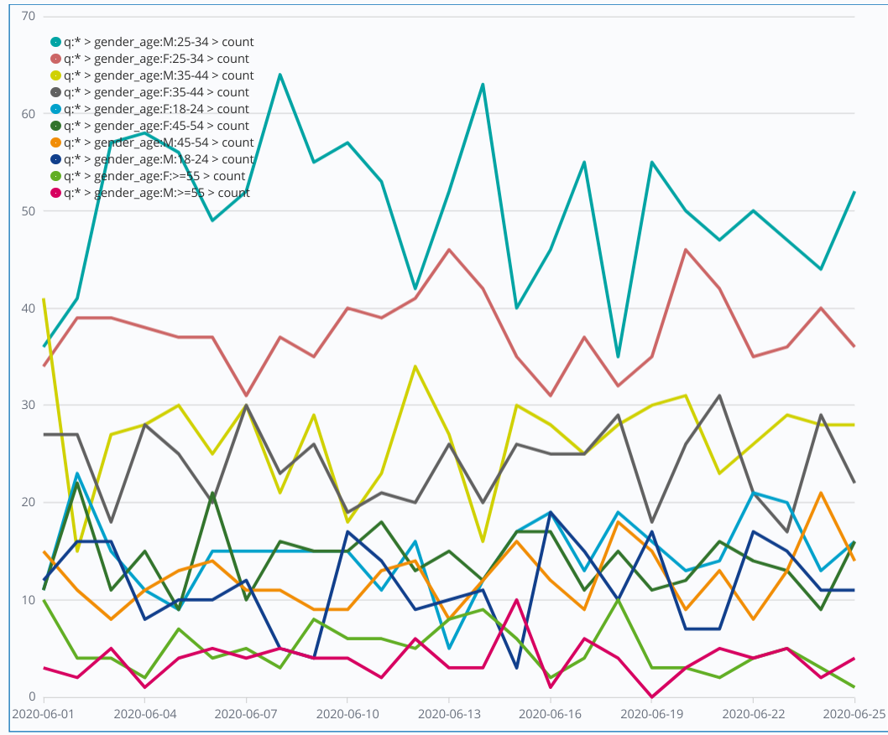
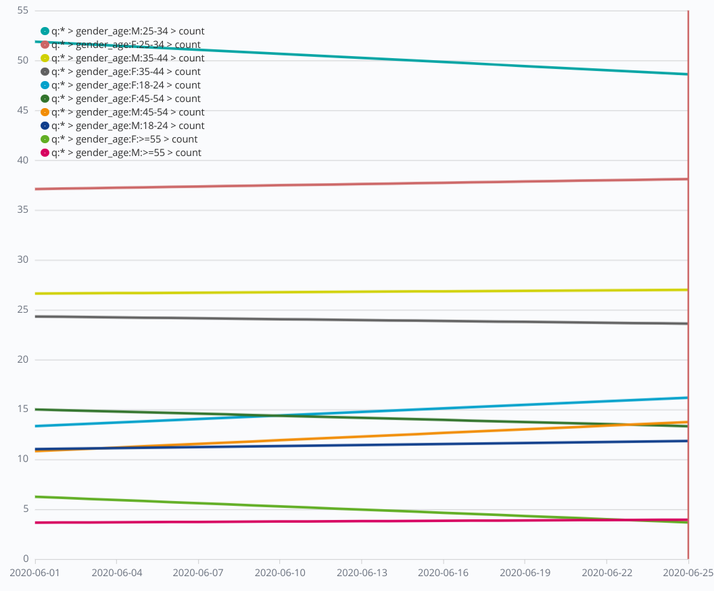

# Лаба 8. Мониторинг качества работы модели машинного обучения с использованием дэшбордов

Итак, у нас есть модель и предсказания пола и возрастной группы по ней. Мы можем посчитать метрику модели, зная метки тестового датасета. Однако в проме у нас нет истинных меток, и надо как-то понимать, модель дает нам то качество предсказаний, на которое мы рассчитываем? Не деградирует ли она со временем?

К этой проблеме подходят по-разному.

1. Бизнес метрика более высокого уровня.

Мы не может посчитать точность предсказания модели, но мы можем подсчитать эффект применения модели. Например, мы определяем пол и возраст новых пользователей, чтобы сделать им таргетированное предложение в рамках маркетинговой кампании. Тогда мы можем подсчитать эффективность кампании с таргетированием через коэффициент конверсии, то есть сколько людей приняло предложение. Конечно, наша модель тут только один из факторов успеха кампании, но все же, стат. методами мы сможем оценить вклад и нашей модели. Например, можем сравнивать конверсию клиентов таргетированной рекламы с полностью случайной рекламной рассылкой. Или сравнивания с результатами работы другой модели.

2. А/Б тестирование

Мы сравниваем работу модели на двух группах: одна – обычные рандомные пользователи, другая – контрольная – состоит из пользователей, которых мы знаем.

3. Смотрим на внутренние показатели работы модели.

К таковым относится, например, распределение предсказаний модели по классам. Если оно начинает сдвигаться со временем, то возможно, что надо переучивать модель на свежих данных.

## I. Задача с высоты птичьего полета

Давайте проиллюстрируем последний способ. Вы запишите ваши предсказания в ElasticSearch и далее построите dashboard с графиками изменений числа предсказаний в каждом классе со временем. По линиям тренда будет видно, дрейфует ли модель.

## II. Реализация

В HDFS в папке /labs/laba08 лежит тестовый датасет из Лабы 07, только теперь в сообщениях добавлена в поле `date` временная метка, соответствующая определенному дню, в который были получены данные о конкретном пользователе. Для удобства, 5000 сообщений в этом тестовом датасете разбиты на 25 частей. Предполагается, что каждая часть – предсказания за определенный день, начиная с 1-го июня 2020. Первым 200 сообщениям назначается метка 1-го июня, следующим – 2-го июня и т.д.  То есть мы как бы тестируем нашу модель на протяжении 25 дней, по 200 пользователей в день.

Измените ваше приложение из Лабы 7а таким образом, чтобы записывать предсказания в индекс Elasticsearch под названием `name_surname_lab08`. Поле `date` с временной меткой в миллисекундах эпохи тоже должно копироваться в составе сообщения с предсказанием. 

Перед тем как записывать события в ElasticSearch, создайте индекс используя REST API или функции Spark. Смотрите короткую [справку по АПИ Elasticsearch и Kibana](Elastic_API.md). Залогиньтесь с name.surname и паролем в ЛК.

Постройте в Кибане график (visualization) с числом предсказаний каждого класса в предсказаниях в зависимости от времени.  

Для этого сделайте туннель с локального ПС на мастер с пробросом порта Кибаны: `ssh  -L 5601:10.0.0.5:5601 -i npl.pem name.surname@master` где npl.pem файл приватного ключа сохраненный с https://lk-spark-de.newprolab.com/access в текущую папку для командной строки, master - ваш мастер (2 или 3) и зайдите в браузере на страничку localhost:5601. Залогиньтесь с name.surname и паролем в ЛК. 

Далее, в пункте меню Visualization выберите тип `timelion`, и в качестве `timelion expression` введите: `.es(index=name_surname_lab08, metric=count, timefield=date, split=gender_age:10)`/ Сохраните в правом верхнем углу меню Save под именем `name_surname_lab08`.

Посмотрите, меняется ли распределение классов со временем? 

График должен называться `name_surname_lab08` и выглядеть примерно так:

(это график с истинными метками, у вас может быть другая картинка).

Далее постройте график с трендами предсказаний каждого класса. Воспользуйтесь `.trend()`. Повторите процедуру, только добавьте к концу выражения `.trend()`. Этот график должен называться `name_surname_lab08_trend` и выглядеть он должен примерно так:

Посмотрите, есть ли тренды? В качестве самостоятельного задания со звездочкой подсчитайте статистическими методами, можно ли сделать вывод о наличии тренда? Т.е. примите в качестве нулевой гипотезы, что тренда нет, а в качестве альтернативной, что он есть. Подсчитайте p-value.

Далее создайте dashboard в пункте меню `Dashboard` под названием `name_surname_lab08` и добавьте туда оба графика.

## III. Оформление работы

Ваш проект в репозитории в подпапке lab08 должен называться `dashboard`.

## IV. Доступ к Elastic и Kibana

* Elasticsearch REST API: 10.0.0.5:9200
* Kibana Web UI, REST API: 10.0.0.5:5601 

Для логина в Web UI и аутентификации REST API используйте ваш логин и пароль в ЛК. Web UI доступен с пробросом порта по туннелю или через socks-прокси. Авторизация аккаунтов настроена таким образом, что вы можете создавать индексы с шаблоном name_surname*, и не имеете доступа ни к каким другим индексам.

## V. Проверка

Чекер найдет ваш dashboard, скачает его в формате `json`, и проверит.

### Поля чекера

* `git_correct` – проверка репозитория
* `git_errors` – ошибки репозитория
* `index_correct` – в Elasticsearch имеется индекс `name_surname_lab08` с правильными полями
* `dashboard_correct` – в Kibana имеется dashboard `name_surname_lab08` и он правильный.
* `lab_result`

### Cамопроверка

#### Поиск dashboard

`curl -X GET 10.0.0.5:5601/api/saved_objects/_find?type=dashboard&search=artem_trunov_lab08`

#### Считывание dashboard

`curl -X GET 10.0.0.5:5601/api/kibana/dashboards/export?dashboard=d818cd30-a985-11ea-8889-8de7ce1ad0f9`

В вашем dashboard должно быть три объекта — один с типом dashboard и названием name_surname_lab08, и два с типом visualization и названиями name_surname_lab08, name_surname_lab08_trend.

